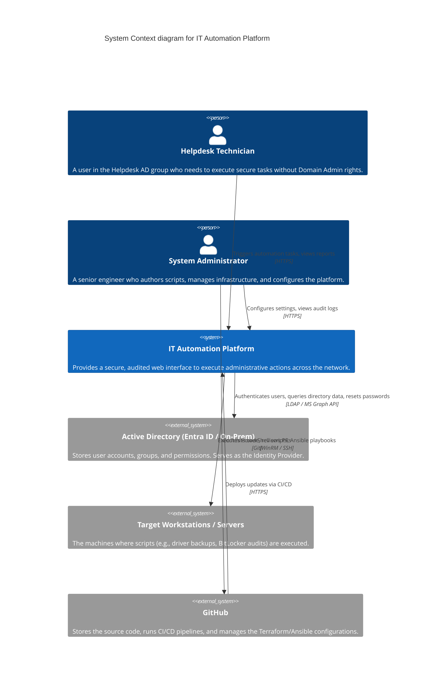
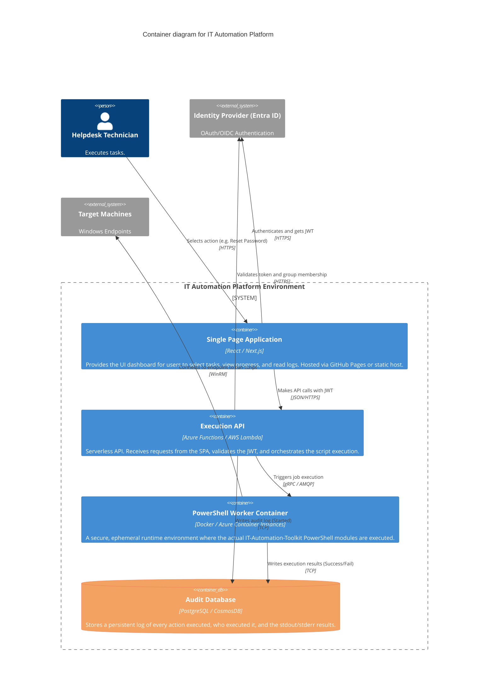

# Target Architecture: IT Automation Platform

This document describes the target architecture of the IT Automation Toolkit, transitioning from local scripts to a cloud-native, self-service platform.

The diagrams below are modeled using the [C4 Model for Visualising Software Architecture](https://c4model.com/).

## 1. System Context Diagram

*This diagram shows the big picture of the system, the users who interact with it, and the external systems it depends on.*

---

## 2. Container Diagram

*This diagram zooms in to the `IT Automation Platform` to show the distinct applications and data stores that make up the system.*

## How This Works (The Flow)

1. The **Helpdesk Technician** goes to the internal website (SPA).
2. They log in with their corporate account via **Active Directory (Entra ID)**.
3. They click "Unlock User".
4. The **SPA** sends an API request to the **Execution API**, attaching their secure login token (JWT).
5. The **Execution API** verifies they are actually in the "Helpdesk" group. If yes, it logs the request in the **Audit Database**.
6. The API sends a message to the **PowerShell Worker Container** to actually run `StaleUserFinder.ps1` or `LocalUserReset.ps1` against the target.
7. The Container executes the raw PowerShell code against the **Target Machine** via WinRM.
8. The result is saved back to the database and returned to the UI.
